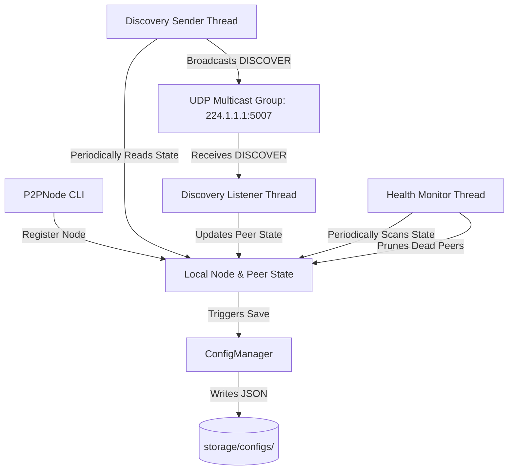

# P2P Multicast System Design Document

This document outlines the architectural design and design choices for the Decentralized Peer-to-Peer Multicast System.

## Architecture Overview

The system is a decentralized peer-to-peer (P2P) network where nodes discover and register each other dynamically using UDP Multicast. No central tracker or coordinator is required.

The system is split into modular components:

1. **`P2PNode` (`core/node.py`)**: The central coordinator that sets up sockets, handles user CLI interactions, and initializes the sub-services.
2. **`ConfigManager` (`core/config_manager.py`)**: Encapsulates configuration input/output. Automatically stores dynamic state in `storage/configs/{port}.json`.
3. **Discovery Service (`core/discovery.py`)**:
   - **Sender Loop**: Periodically broadcasts node presence via UDP multicast packets.
   - **Listener Loop**: Continuously listens for other nodes' multicast broadcasts and registers them in the local configuration.
4. **Health Monitor (`core/health_monitor.py`)**: Runs periodically to detect dead or timed-out nodes. If a peer has not broadcasted its status within 10 seconds, it is automatically removed from the active peer list.
5. **Utilities (`utils/hashing.py`, `utils/constants.py`)**: Houses independent utility routines (such as SHA-256 generation) and global settings.

## Data Flow Diagram

## Network Design

- **Multicast IP**: `224.1.1.1` (Administered/Local Scope multicast address).
- **Multicast Port**: `5007`.
- **Protocol**: UDP (User Datagram Protocol), which enables quick, fire-and-forget discovery broadcasting without the overhead of TCP handshakes.
- **Message Format**: JSON encoded strings transmitted as raw byte payloads.

## State Persistence

To ensure peer lists and self configurations persist between restarts, each node maintains its own JSON file named `<port>.json` located in `storage/configs/`. The file records:
- The node's generated Peer ID (`<IP>:<Port>`)
- Port allocation
- List of registered channels/nodes
- Discovered peers list including peer IDs, IPs, ports, nodes lists, state hashes, and last-seen timestamps.
