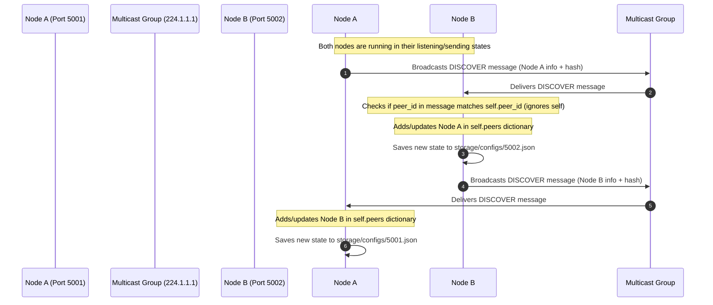

# P2P Multicast System Workflow

This document details the step-by-step connection sequences and state transitions for a node in the system.

## 1. Node Initialization Workflow

When a node starts:
1. **Interactive Prompt**: The node prompts the user for a dynamic port number.
2. **Identity Creation**: Resolves the machine's local IP address and pairs it with the port to construct a unique `peer_id` (e.g., `192.168.1.15:5001`).
3. **Config Loading**: Initializes the `ConfigManager` and attempts to load `storage/configs/{port}.json`.
   - If found: Restores its list of registered nodes and previous peers list.
   - If not: Creates a new config file on disk.
4. **Socket Setup**: Creates a UDP socket, binds it to the multicast port (`5007`), and registers membership in the multicast group (`224.1.1.1`).
5. **Self Registration**: The node initializes itself in its own peers map (so its metadata, hash, and status are tracked locally).
6. **Thread Launching**: Spins up three background daemon threads:
   - **Discovery Listener thread**
   - **Discovery Sender thread**
   - **Health Monitor thread**
7. **CLI Shell**: Enters the main command-line loop.

---

## 2. Peer Discovery Workflow

When discovery happens:

---

## 3. Dynamic Health Checking (Pruning) Workflow

1. The Health Monitor thread sleeps for 2 seconds, then wakes up.
2. It obtains the lock and iterates over all entries in the `peers` dictionary.
3. For each peer:
   - It calculates `current_time - peer_info["last_seen"]`.
   - If the difference is greater than `PEER_TIMEOUT` (10 seconds), the peer is marked for deletion.
4. Once checking is done:
   - It deletes all marked peers from `self.peers`.
   - If any peers were removed, it prints `Removed inactive peer: <peer_id>` and invokes `self.save_config()` to update `storage/configs/{port}.json`.
5. The thread sleeps again for 2 seconds.
